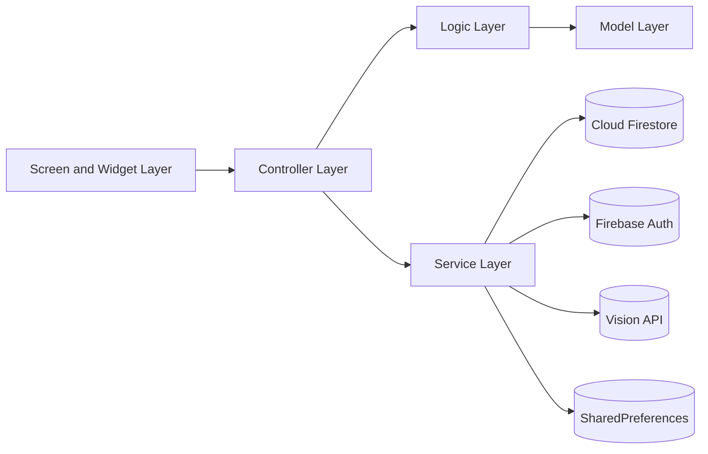
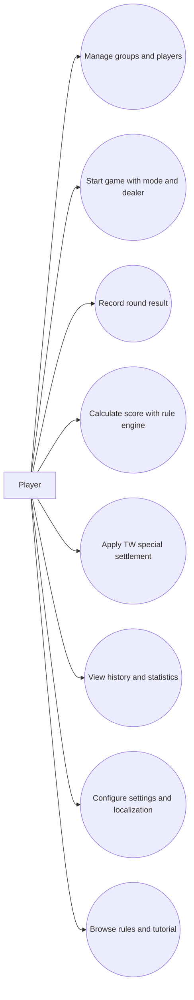
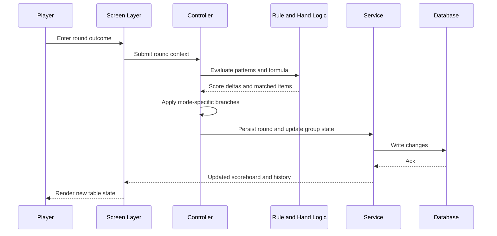
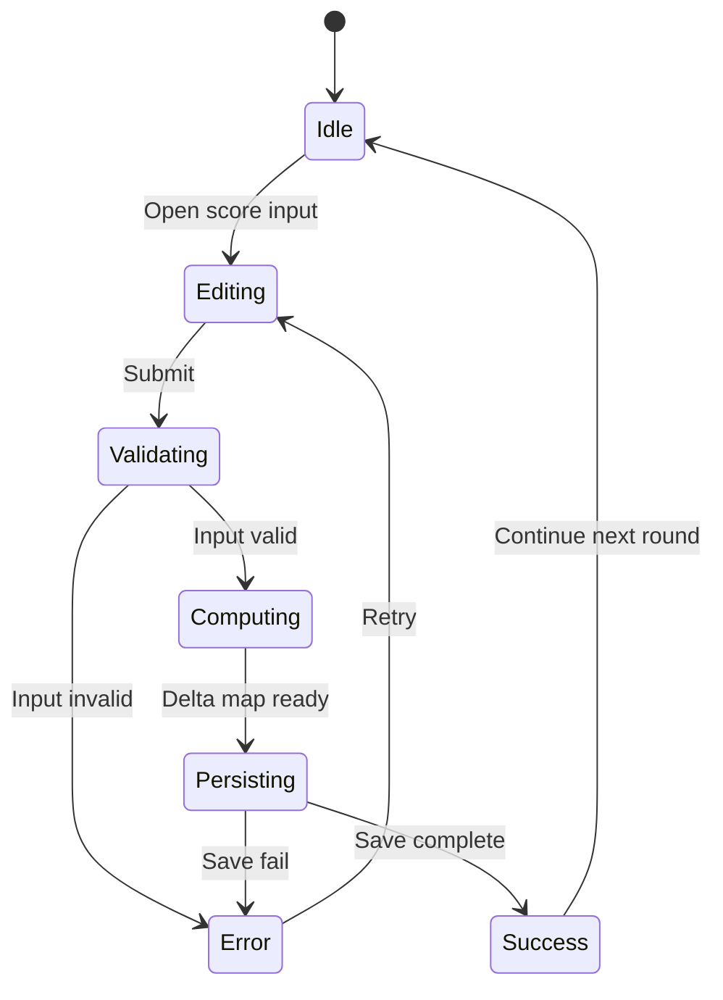
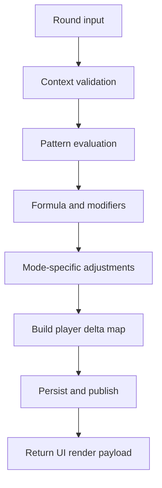

# Final Year Project Report

Submitted in partial fulfillment of the requirements for the degree of  
Bachelor of Science (Honours) in Computer Science  
Hong Kong Baptist University  
April, 2026

Project Title: Mahjong Score Calculator App  
Student Name: [Your Full Name]  
Student ID: [Your Student ID]  
Supervisor: [Supervisor Name]

---

## Declaration

I hereby declare that all the work done in this Final Year Project is of my independent effort. I also certify that I have never submitted the idea and product of this Final Year Project for academic or employment credits.

Signature: _________________________

Date: _________________________

---

## Acknowledgments and AI Disclosure

I would like to express my sincere gratitude to my supervisor, [Supervisor Name], for continuous guidance, constructive feedback, and support throughout this project.

I also thank my friends and test users for practical feedback on gameplay flow, scoring explanation clarity, and UI usability.

AI disclosure statement (edit this to match your actual use exactly):

1. AI tools used: [Tool name and version].
2. Scope of use: grammar correction, wording polishing, and formatting assistance only.
3. Sections affected: [List exact sections].
4. Level of use: editorial support only; all technical claims, design decisions, implementation, experiments, and conclusions are my own.
5. Responsibility statement: I take full responsibility for correctness, originality, and citation integrity.

Note: if no AI was used at all, replace this section with a direct statement of no AI usage.

---

## Content

Abstract

Chapter 1 Introduction  
1.1 Background  
1.2 Problem Statement  
1.3 Objectives  
1.4 Proposed Solutions

Chapter 2 System Overview  
2.1 System Architecture  
2.2 Existing Applications  
2.3 Technology Stack  
2.4 Design Pattern

Chapter 3 System Functionalities and Implementation  
3.1 Use Case Diagram  
3.2 Horizontal Swimlane Diagram  
3.3 Frontend Functions  
3.4 Backend Functions  
3.5 Page Inventory and Expected Outputs  
3.5.1 Functional Requirement Traceability Matrix

Chapter 4 Performance Results  
4.1 Testing Strategy  
4.2 Unit Test Coverage  
4.3 Logic Layer Tests  
4.4 Controller Tests  
4.5 Model Tests  
4.6 Service Tests  
4.7 Utility Tests

Chapter 5 Discussion  
5.1 Difficulties and Limitations  
5.2 Further Development

Chapter 6 Conclusion

References  
Appendices

---

## Abstract

Mahjong scoring is difficult in real gameplay because scoring rules are dense, region-dependent, and highly interactive. Players often pause rounds to manually validate winning patterns, calculate payouts, and resolve disagreements. This project develops a cross-platform mobile application, Mahjong Score Calculator App, to automate scoring and game record management for both Hong Kong style and Taiwan style Mahjong.

The system is implemented with Flutter and Dart, with Firebase services for persistence and account handling. The core contribution is a scoring engine that supports two major game variants with different formulas and rule interactions. Beyond basic fan/tai accumulation, the implementation handles non-trivial mechanisms such as Taiwan dealer bonus propagation, pattern stacking/exclusion logic, and La carry-over settlement with compounding and stop-rule handling.

The application also includes practical modules for player group management, in-session round recording, history and statistics display, configurable settings, bilingual localization, and an achievement subsystem. A camera-assisted tile recognition path is integrated through a vision service API pipeline.

Validation is primarily unit-test driven across logic, controller, model, service, utility, and scenario layers. In the latest project-wide automated run (March 19, 2026), 776 tests were executed with 774 passing and 2 failing scenario assertions (legacy expectation mismatch after scoring-rule updates). This test structure provides strong confidence in core calculation correctness and regression safety for continuous iteration.

The project demonstrates a complete engineering workflow from architecture design to implementation and verification, with practical value for Mahjong players and a maintainable base for future expansion.

---

## Chapter 1 Introduction

### 1.1 Background

Mahjong is a popular table game with substantial regional rule variation. Although gameplay is social and interactive, score computation is often disruptive because players must:

1. Identify all valid patterns in a winning hand.
2. Resolve overlapping or mutually exclusive pattern combinations.
3. Apply mode-specific formulas and payout distribution rules.
4. Track cumulative scores across many rounds.

In Hong Kong style, scoring is fan-based with capped payout tables. In Taiwan style, scoring uses tai-oriented arithmetic with additional mechanics such as dealer progression and carry-over settlement behaviors. Manual handling of these mechanics is slow and error-prone, especially under time pressure.

[Screenshot Needed 1-1: App home/dashboard screen]

### 1.2 Problem Statement

The project addresses five concrete problems:

| Problem ID | Problem | Practical impact |
|---|---|---|
| P1 | Manual scoring complexity | Round interruption and frequent arithmetic mistakes |
| P2 | Rule interaction ambiguity | Disputes over valid combinations and exclusions |
| P3 | Dual-mode management burden | Difficulty switching correctly between HK and TW logic |
| P4 | Weak historical tracking | Hard to review progress, trends, and player stats |
| P5 | Fragmented toolchain | Players need multiple apps or paper records |

### 1.3 Objectives

The project objectives are defined to be measurable and implementation-oriented.

| Objective ID | Objective | Success indicator |
|---|---|---|
| O1 | Implement accurate HK and TW scoring | Correct outputs in controller/logic tests |
| O2 | Support full round workflow | End-to-end round input to score update |
| O3 | Provide persistent group and history management | Group/session data is saved and reloadable |
| O4 | Deliver practical usability features | Rules/tutorial/settings/localization available |
| O5 | Ensure engineering robustness | Wide automated test coverage and regression tests |

### 1.4 Proposed Solutions

The project adopts a layered solution:

1. Controller-driven scoring orchestration.
2. Dedicated logic modules for pattern and hand validation.
3. Service layer for persistence, settings, and external integration.
4. Screen/widget layer for guided user workflows.
5. Extensive automated tests for formula and edge-case correctness.

Non-trivial contribution focus:

1. Taiwan La settlement behavior modeling (compound/reduce/settle transitions).
2. Pattern stacking and exclusion enforcement in Taiwan evaluator.
3. Dealer bonus and payment-side correctness under discard/self-draw branches.
4. Achievement progression logic decoupled from UI for deterministic validation.

---

## Chapter 2 System Overview

### 2.1 System Architecture

The system uses a service-controller-widget architecture with clear responsibilities.

Key architecture rationale:

1. Keep scoring and validation logic testable and UI-independent.
2. Keep persistence and external dependencies in services.
3. Keep screen state orchestration in controllers and not in widgets.

[Screenshot Needed 2-1: Project structure in IDE explorer]

### 2.2 Existing Applications

A gap analysis motivated this project:

| Capability | Typical lightweight score app | Tracker-only app | This project |
|---|---|---|---|
| HK scoring | Partial | No | Yes |
| TW scoring | Rare/partial | No | Yes |
| In-round recording flow | Limited | Yes | Yes |
| History and group persistence | Limited | Partial | Yes |
| Built-in rules/tutorial content | Limited | No | Yes |
| Configurable settings | Limited | Partial | Yes |
| Test-driven rule validation | Usually not visible | Usually not visible | Yes |

### 2.3 Technology Stack

The stack is selected for maintainability and shipping speed:

| Layer | Technology | Evidence in project |
|---|---|---|
| UI framework | Flutter 3.8.1+ | pubspec and screen modules |
| Language | Dart SDK 3.8.1+ | environment configuration |
| State management | Provider 6.1.5+1 | MultiProvider in app entry |
| Backend | Firebase Core/Firestore/Auth | dependencies and service modules |
| Local settings | SharedPreferences | settings service |
| Media input | image_picker | tile image workflow |
| API communication | http | vision service pipeline |
| Localization | intl + flutter_localizations | l10n structure and generated keys |
| Config | flutter_dotenv | environment init in app startup |
| Testing | flutter_test | test suite across six categories |

### 2.4 Design Pattern

The design follows a layered, responsibility-separated pattern:

1. UI layer: route navigation, form interaction, visualization.
2. Controller layer: score flow orchestration, domain state updates.
3. Logic layer: hand validation, pattern matching, exclusion rules.
4. Service layer: persistence, authentication, settings, API calls.
5. Model layer: domain entities, serialization, immutable updates.

This pattern improves:

1. Testability (logic without widget coupling).
2. Readability (clear domain boundaries).
3. Extendability (new features can be localized to one layer).

---

## Chapter 3 System Functionalities and Implementation

This chapter presents implementation details in functional form, including tables and diagrams.

### 3.1 Use Case Diagram

Use case detail table:

| Use Case | Preconditions | Main output |
|---|---|---|
| Manage groups and players | User authenticated | Group document persisted |
| Start game | Group exists | Session initialized |
| Record round | Session active | Round delta and updated totals |
| Calculate score | Winner and context provided | Deterministic score map |
| Apply TW settlement | TW mode and streak context | Adjusted settlement map |
| View history/statistics | Group data available | Round log and aggregate stats |
| Configure app | Settings page open | Preference persistence and reactive UI update |

[Screenshot Needed 3-1: Group setup and player editor]
[Screenshot Needed 3-2: Dealer/mode selection dialog]

### 3.2 Horizontal Swimlane Diagram

Swimlane explanation table:

| Step | Owner | Risk point | Mitigation |
|---|---|---|---|
| S1 | UI | Invalid input combinations | Input guards and required fields |
| S2 | Controller | Wrong branch for draw/discard | Explicit branch tests |
| S3 | Logic | Pattern overlap error | Exclusion and regression tests |
| S4 | Service | Partial write or stale state | Structured save path and snapshots |

[Screenshot Needed 3-3: Round recording table]
[Screenshot Needed 3-4: Score calculation result summary]

### 3.3 Frontend Functions

Frontend function matrix:

| Screen/Component | Core function | Inputs | Outputs |
|---|---|---|---|
| Splash/Auth wrapper | Entry gating by auth state | Auth stream | Home or login routing |
| Home dashboard | Launch and group overview | Saved groups | Start/resume actions |
| Player setup | Group creation/editing | Names, mode, parameters | Group config |
| Score recording | In-game orchestration | Round results | Updated scoreboard/history |
| Score calculation | Hand-level scoring interaction | Winner, draw/discard, tiles, specials | Score delta map |
| Tile selection | Manual tile input | Suit-tab selections | Structured hand data |
| Rules/Tutorial | Learning and lookup | Filter/search/mode | Rule and tutorial content |
| Settings | Personalization | Language/theme/config values | Persisted preference state |
| Achievement screen | Progress visualization | Player/group context | Unlock and progress views |

Frontend state flow (round recording):

[Screenshot Needed 3-5: Home dashboard with group list]
[Screenshot Needed 3-6: Rules or tutorial page]
[Screenshot Needed 3-7: Settings page (language/theme)]

### 3.4 Backend Functions

Backend modules and responsibilities:

| Module | Responsibility | Implementation significance |
|---|---|---|
| score_calculation_controller | Main scoring orchestration and submit result map | Core project logic center |
| tw_pattern_evaluator | Taiwan pattern evaluation with exclusion handling | Non-trivial rule interaction logic |
| hand_validator / hand_core / hand_patterns | Structural hand validation and combinational checks | Correctness foundation for scoring |
| score_service | Runtime score and round state container | Session state consistency |
| player_group_service | Firestore CRUD for groups and game snapshots | Persistence reliability |
| achievement_service + checker + registry | Achievement counters, unlock logic, storage | Decoupled gamification engine |
| settings_service | Theme/language/rule-value persistence | User customization continuity |
| vision_service | External recognition API integration | Practical input acceleration |
| la_settlement utility | TW carry-over debt model and force-settle paths | Advanced mode-specific behavior |

Data model table:

| Entity | Example fields | Role |
|---|---|---|
| Player | id, name, score | Runtime participant state |
| PlayerGroup | players, scores, round metadata | Persistent session container |
| PlayerStats | wins, losses, rates, totals | Cumulative analytics |
| Rule | name, value, explanation, validator | Scoring definition |
| GameMode | hongKong/taiwan | Mode split control |
| TW hand model | concealed/exposed/winning tile | Structured TW evaluation input |

Backend scoring flow:

Implementation evidence from codebase:

1. App startup initializes environment, Firebase, and settings before UI boot.
2. Route generator centralizes navigation and typed arguments.
3. Services are grouped by domain (auth, group, score, vision, settings, achievement).
4. Logic folder isolates hand/pattern evaluation modules from screen code.

[Screenshot Needed 3-8: Firestore group document example (with sensitive info masked)]
[Screenshot Needed 3-9: Debug output of score map from one real round]

### 3.5 Page Inventory and Expected Outputs

This section maps each implemented page to its primary function and expected outputs, including branch outcomes where applicable.

| Page / Route | Main function | Expected output(s) |
|---|---|---|
| SplashScreen (`/`) | App launch transition and branding animation | 1. Shows splash animation and loading indicator. 2. Automatically transitions to auth wrapper after delay. |
| AuthWrapper (`/auth`) | Authentication gate based on Firebase auth stream | 1. Waiting state: loading spinner. 2. Authenticated state: home page. 3. Unauthenticated state: login page. |
| LoginScreen (`/login`) | Email/password sign-in and account creation | 1. Input validation errors for invalid form. 2. Loading state during auth call. 3. Error message from auth exception. 4. Successful auth leads to home via auth-state change. |
| HomePage (`/home`) | Main dashboard, quick start, and group entry point | 1. Shows loading, empty state, or group list. 2. HK/TW quick-start opens player setup with mode preset. 3. Selecting a group opens group detail. 4. Edit/delete actions update persisted group list and show feedback snackbar. |
| PlayerSetupScreen (`/player-setup`) | Create/edit group, configure seats and dealer, launch game | 1. Reorder player seats and edit names with duplicate guard. 2. Save or delete group state. 3. Start game opens dealer selection and navigates to score recording with selected configuration. |
| SavedGroupsScreen (`/saved-groups`) | Full saved-group management with pagination | 1. Displays paged group list or empty state. 2. Play action opens group detail. 3. Edit action opens prefilled player setup. 4. Delete action confirms removal and shows success snackbar. |
| GroupDetailScreen (`/group-detail`) | Group overview, merged stats, start/resume control | 1. Shows summary and per-player stats. 2. Resume sends current state to score recording. 3. Start new game either requests confirmation (if active game exists) or opens dealer selection directly, then starts a fresh session. |
| ScoreRecordingScreen (`/score-recording`) | Round orchestration, score updates, and game lifecycle control | 1. Opens score calculation and applies returned delta map. 2. Handles no-result rounds and round progression. 3. In TW mode, applies La settlement and stop-rule branch dialogs. 4. Supports instant payment flow (TW) and records it in round history. 5. Shows game-end dialog with final score summary and finish/back branches. |
| ScoreCalculationScreen (`/score-calculation`) | Build one-round scoring result from winner, hand, and conditions | 1. Supports camera/gallery tile recognition with success/failure snackbars. 2. Supports manual HK or TW hand selection flow. 3. Submit returns structured scoring result map to score recording. 4. Cancel returns without result. |
| TileSelectionScreen (`/tile-selection`) | Manual HK/general tile input and validity checking | 1. Enforces per-tile and total-tile limits with alerts. 2. Continuously validates hand structure. 3. Confirm returns selected tile list only when hand is valid. |
| TwTileSelectionScreen (`/tw-tile-selection`) | Manual TW hand construction (melds, concealed zone, winning tile, ding) | 1. Supports chow/pong/kong/concealed-kong composition. 2. Enforces tile and meld validity constraints with alerts. 3. Shows live hand validity status. 4. Confirm returns structured TW hand model only when valid. |
| RulesScreen (`/rules`) | Rules reference and tutorial hub for HK/TW modes | 1. Provides two-tab interface: rules reference and tutorial. 2. Supports mode toggle, fan/tai filter, and text search. 3. In TW mode, shows additional sections (instant pay, penalties, dealer bonus, La settlement). 4. Tutorial rule taps can jump to filtered rule view in reference tab. |
| SettingsScreen (`/settings`) | User preferences and ruleset parameter configuration | 1. Updates language and theme preferences. 2. Configures HK min/max fan and TW base tai. 3. Manages TW payment presets (built-in + custom). 4. Opens custom fan/tai editor. 5. Supports logout with confirmation and navigation reset. |
| AchievementScreen (`/achievements`) | Achievement progression display per player/group | 1. Shows unlocked ratio and progress bar. 2. Supports category tabs (all/general/HK/TW/milestone). 3. Displays per-achievement progress and unlock timestamp when completed. |
| CustomFanEditorScreen (`/custom-fan-editor`) | Customize HK fan and TW tai definitions | 1. Add/edit/delete custom rules. 2. Override built-in values and reset to default. 3. Soft-delete/restore built-in rules. 4. Reset HK or TW customizations with confirmation. |
| Router fallback (undefined route) | Safety fallback for unknown route name | Displays a fallback message page indicating route is not defined. |

Supporting in-page navigation shell:

| Component | Function | Expected output(s) |
|---|---|---|
| BaseScreen (bottom navigation shell) | Shared home/rules/settings bottom tab navigation | 1. Highlights active tab index. 2. Route replacement to Home, Rules, or Settings when another tab is tapped. |

Implementation note:

1. The page list above is route-verified through centralized routing constants and route generator mapping.
2. Branch outputs (success/failure/cancel/confirm) are included for workflow-heavy pages to support test-case design and requirements traceability.

#### 3.5.1 Functional Requirement Traceability Matrix

The following matrix links user-facing functional requirements to concrete pages, branch outputs, and verification evidence.

| Req ID | Functional requirement | Primary page(s) | Trigger and key input | Expected output(s) | Exception / alternate output | Verification evidence |
|---|---|---|---|---|---|---|
| FR-01 | Authentication-gated app entry | SplashScreen, AuthWrapper | App launch and auth-state stream | User is routed to Home (signed-in) or Login (signed-out) | Waiting state shows loading indicator | Manual flow + [test/services/score_service_test.dart](test/services/score_service_test.dart) for state behavior baseline |
| FR-02 | Email login and account registration | LoginScreen | Submit email/password form | Authentication success and transition to Home | Validation error or Firebase error message | Manual flow |
| FR-03 | Create/edit group and start game | PlayerSetupScreen | Input group/player info, choose dealer/mode | Group saved and game session opened in score recording page | Duplicate-name guard blocks start; delete branch removes group | Manual flow + [test/models/player_group_test.dart](test/models/player_group_test.dart) |
| FR-04 | Manage saved groups with CRUD actions | SavedGroupsScreen | Play/Edit/Delete actions on group list | Navigation to detail/setup and persisted list refresh | Delete cancelled by user confirmation dialog | Manual flow |
| FR-05 | Start new game or resume existing game | GroupDetailScreen | New game or resume action | Correct state passed into score recording | Active-game warning branch before starting new session | Scenario flow: [test/scenarios/tw_full_game_flow_test.dart](test/scenarios/tw_full_game_flow_test.dart) |
| FR-06 | Compute and submit round score | ScoreCalculationScreen, ScoreRecordingScreen | Select winner/hand/conditions and submit | Deterministic score delta map applied to scoreboard and history | Cancel returns no result; invalid hand cannot submit | [test/controllers/score_calculation_controller_test.dart](test/controllers/score_calculation_controller_test.dart), [test/controllers/tw_score_formula_test.dart](test/controllers/tw_score_formula_test.dart) |
| FR-07 | Validate HK/TW hand legality before submission | TileSelectionScreen, TwTileSelectionScreen | Manual tile input by category and zone | Confirm enabled only when hand model is valid | Tile-count/meld violations trigger alert message | [test/logic/hand_validator_test.dart](test/logic/hand_validator_test.dart), [test/logic/hand_core_test.dart](test/logic/hand_core_test.dart), [test/logic/hand_patterns_test.dart](test/logic/hand_patterns_test.dart) |
| FR-08 | Taiwan pattern stacking/exclusion correctness | ScoreCalculationScreen (TW mode) | TW hand with overlapping candidate patterns | Only valid combination is scored according to exclusion rules | Mutually exclusive patterns are filtered out | [test/logic/tw_pattern_evaluator_test.dart](test/logic/tw_pattern_evaluator_test.dart), [test/logic/tw_fan_exclusion_test.dart](test/logic/tw_fan_exclusion_test.dart), [test/logic/tw_fan_combination_test.dart](test/logic/tw_fan_combination_test.dart) |
| FR-09 | Taiwan dealer bonus and branch payouts | ScoreRecordingScreen (TW mode) | Win result (self-draw/discard) plus dealer context | Correct dealer bonus and payer distribution | Branch mismatch prevented by explicit controller logic | [test/controllers/tw_dealer_bonus_test.dart](test/controllers/tw_dealer_bonus_test.dart), [test/controllers/tw_score_formula_test.dart](test/controllers/tw_score_formula_test.dart) |
| FR-10 | Taiwan La debt carry-over and force settlement | ScoreRecordingScreen (TW mode) | Consecutive-loss state and stop-rule dialog choice | Debt state transitions and score adjustments applied correctly | Continue branch keeps debt pending; force-settle branch clears selected debt | [test/utils/la_settlement_test.dart](test/utils/la_settlement_test.dart) |
| FR-11 | In-game history and finalization persistence | ScoreRecordingScreen | End round / finish game actions | Round history, final scores, and player stats persisted | Back-to-game branch exits game-over dialog without finalizing | [test/services/score_service_test.dart](test/services/score_service_test.dart), [test/scenarios/tw_full_game_flow_test.dart](test/scenarios/tw_full_game_flow_test.dart) |
| FR-12 | Rule/tutorial lookup and learning support | RulesScreen, TutorialTab | Mode toggle, fan/tai filter, search, tutorial navigation | Filtered rule list and tutorial page transitions | Empty/no-match filter returns reduced rule list view | Manual flow |
| FR-13 | Settings personalization and rule-value configuration | SettingsScreen, CustomFanEditorScreen | Update language/theme/rule parameters | Preferences persisted and reflected in UI behavior | Invalid numeric value input blocked with feedback message | Manual flow + [test/models/rule_test.dart](test/models/rule_test.dart) |
| FR-14 | Achievement progress and unlock tracking | AchievementScreen, ScoreRecordingScreen | Round/instant-payment progression events | Progress bars and unlock records updated per player | Not-yet-unlocked achievements remain in progress state | [test/utils/achievement_checker_test.dart](test/utils/achievement_checker_test.dart), [test/utils/achievement_registry_test.dart](test/utils/achievement_registry_test.dart), [test/models/achievement_test.dart](test/models/achievement_test.dart) |

Traceability usage note:

1. FR IDs can be referenced directly in Chapter 4 test evidence and Appendix A.
2. Rows marked as manual flow should be validated with screenshot-backed test scripts in Appendix B.

---

## Chapter 4 Performance Results

### 4.1 Testing Strategy

The project uses a layered testing strategy aligned with module boundaries.

| Layer | Goal | Typical defects caught |
|---|---|---|
| Logic | Mathematical/rule correctness | Wrong pattern activation, exclusion bugs |
| Controller | Orchestration correctness | Incorrect payer/winner mapping |
| Model | Data integrity and serialization | Broken persistence mapping |
| Service | State transition correctness | Inconsistent updates or stale snapshots |
| Utility | Deterministic helper behavior | Settlement and achievement edge cases |
| Scenario | Multi-round behavior realism | Branch interactions over game flow |

### 4.2 Unit Test Coverage

Repository-level automated evidence (March 19, 2026):

| Metric | Value |
|---|---|
| Test files under test directory | 30 |
| Declared test blocks (test(...)) | 771 |
| Latest full automated run executed | 776 |
| Passed | 774 |
| Failed | 2 |

Failure summary from the latest full run:

1. test/scenarios/tw_20_hands_scenario_test.dart, scenario 2 expected value mismatch (42 vs 43).
2. test/scenarios/tw_20_hands_scenario_test.dart, scenario 5 expected value mismatch (-21 vs -14).

Interpretation:

1. Core suites remain highly stable with a very high pass ratio.
2. Two failing scenario expectations indicate rule/expectation drift after scoring logic updates, not widespread engine failure.

[Screenshot Needed 4-1: Full test run terminal output showing pass/fail summary]

### 4.3 Logic Layer Tests

| Sub-area | Observed emphasis |
|---|---|
| Hand structure validation | Recursive decomposition and kong-aware tile count paths |
| Pattern detection | Positive and negative assertions across many patterns |
| Exclusion/stacking | Dedicated tests for mutually exclusive Taiwan patterns |
| TW evaluator behavior | Extensive targeted files for advanced combinations |

Quantitative note: logic-folder tests are the largest portion of the suite, reflecting project emphasis on scoring correctness.

### 4.4 Controller Tests

Controller tests verify full scoring flow behavior under many branches:

1. Winner/discard/self-draw routing.
2. HK and TW formula output correctness.
3. Dealer bonus branch behavior.
4. Result map structure used by score recording screen.
5. Localization-safe display output for special items.

This layer is critical because it bridges logic correctness and session persistence.

### 4.5 Model Tests

Model tests focus on:

1. Constructor defaults and immutability semantics.
2. JSON serialization/deserialization round-trips.
3. Optional field fallback behavior.
4. Basic domain enum and rule list sanity checks.

These tests reduce data corruption risk in cloud persistence and historical replay.

### 4.6 Service Tests

Service tests currently focus on score service state transitions:

1. Initialization.
2. Score updates.
3. Round progression.
4. End-of-game checks.
5. Stream notification behavior.

Service coverage can be expanded further with mocked Firestore interaction tests in future work.

### 4.7 Utility Tests

Utility tests include heavy coverage for:

1. La settlement transitions, compounding, reduction, force settlement, and reset behavior.
2. Achievement registry integrity and category consistency.
3. Achievement checker counter progression and unlock conditions.

These tests are important for non-trivial game mechanics beyond base scoring formulas.

[Screenshot Needed 4-2: Representative passing regression test output for La settlement or dealer bonus]

---

## Chapter 5 Discussion

### 5.1 Difficulties and Limitations

Main engineering challenges:

| Area | Difficulty | Impact | Current status |
|---|---|---|---|
| Rule interaction | Overlap and exclusion among high-value patterns | Potential double counting | Mitigated by explicit exclusion logic and tests |
| TW settlement complexity | Multi-round debt transitions with branch conditions | Hard-to-debug scenario drift | Utility tests and scenario cases implemented |
| Scenario maintenance | Expected values can drift after logic correction | Failing legacy assertions | Two known scenario mismatches remain |
| External API reliance | Vision path depends on network/service availability | Recognition latency and reliability variance | Manual tile selection remains fallback |
| Cross-platform validation depth | Primary development on one environment | Device-specific behavior risk | Additional device matrix testing recommended |

Limitations of current report evidence:

1. Test summary is strong but mostly unit-focused.
2. End-user usability study is not presented as a formal experiment.
3. Vision model accuracy benchmark (precision/recall by dataset) is not yet included.

### 5.2 Further Development

Planned next-stage improvements:

| Priority | Item | Expected benefit |
|---|---|---|
| High | Resolve remaining scenario expectation drift and pin versioned rule baselines | Full green CI regression confidence |
| High | Add integration/widget tests for key UI flows | Better end-to-end reliability |
| High | Add automated Firestore contract tests with mocks | Safer persistence evolution |
| Medium | Add offline-first behavior for selected workflows | Better resilience during poor network conditions |
| Medium | Expand analytics dashboards for player trends | More value from accumulated history |
| Medium | Improve vision validation dataset and benchmark reporting | Quantified AI feature reliability |
| Low | Add additional Mahjong variants beyond HK/TW | Broader user coverage |

---

## Chapter 6 Conclusion

This project successfully delivers a practical and technically substantial Mahjong scoring application with dual-mode support, persistent group management, and broad automated validation. The implementation demonstrates clear separation of concerns, maintainable module boundaries, and strong emphasis on correctness for a rule-heavy domain.

The most important project outcomes are:

1. A functioning HK/TW scoring engine integrated into real gameplay workflow.
2. Handling of advanced TW mechanics including carry-over settlement behavior.
3. A complete mobile system with history, settings, localization, and achievement features.
4. A large automated test base that catches regressions and supports iterative refinement.

While two scenario assertions remain to be updated in the latest full run, the overall quality signal is strong and the platform is ready for continued extension. The project meets its core objectives and provides a robust foundation for production-grade enhancement.

---

## References

[1] Flutter documentation. https://flutter.dev

[2] Firebase documentation. https://firebase.google.com

[3] Dart language documentation. https://dart.dev

[4] Provider package documentation. https://pub.dev/packages/provider

[5] SharedPreferences package documentation. https://pub.dev/packages/shared_preferences

[6] image_picker package documentation. https://pub.dev/packages/image_picker

[7] Ultralytics documentation. https://docs.ultralytics.com

[8] HTTP package documentation. https://pub.dev/packages/http

[9] Flutter internationalization guide. https://docs.flutter.dev/ui/accessibility-and-internationalization/internationalization

Note: Replace or supplement these with formal academic and domain-rule references required by your department citation standard.

---

## Appendices

### Appendix A Test Evidence Pack

Include:

1. Full terminal output of the latest full test run.
2. Two failing scenario traces and your post-analysis notes.
3. A table mapping high-risk logic branches to specific test files.

### Appendix B User Manual

Include annotated screenshots for:

1. Login and home.
2. Group creation.
3. Starting a game.
4. Recording a round.
5. Score calculation and result confirmation.
6. Rules/tutorial usage.
7. Settings and localization changes.

### Appendix C Technical Manual

Include:

1. Firestore document schema used by group and achievement storage.
2. Service interface summary.
3. Routing and argument model summary.
4. Environment variable setup for vision service integration.

### Appendix D Screenshot Checklist

- [ ] S1 Home/dashboard screen
- [ ] S2 Group setup screen
- [ ] S3 Dealer and mode selection dialog
- [ ] S4 Round recording table screen
- [ ] S5 Score calculation details screen
- [ ] S6 Rules/tutorial screen
- [ ] S7 Settings screen
- [ ] S8 Firestore document sample (masked)
- [ ] S9 Full test run output
- [ ] S10 Scenario failure output (for transparency section)

### Appendix E Final Submission Checklist

1. Confirm all placeholders are replaced with your own final wording where required.
2. Ensure chapter numbering and figure/table numbering are consistent.
3. Ensure every figure and table is referenced in chapter text.
4. Ensure AI disclosure exactly matches real usage.
5. Ensure citations match your required style guide.
